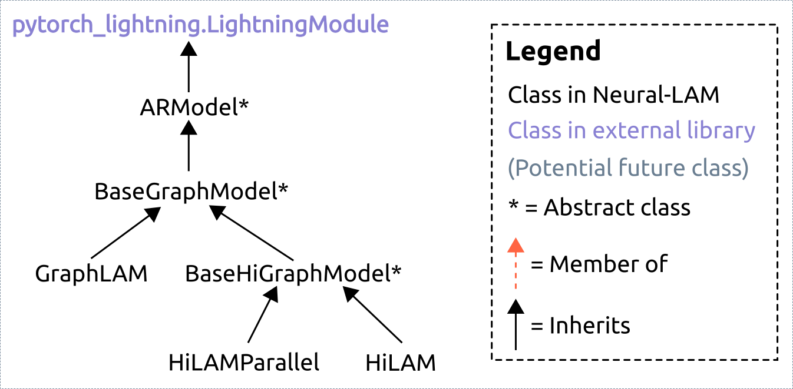
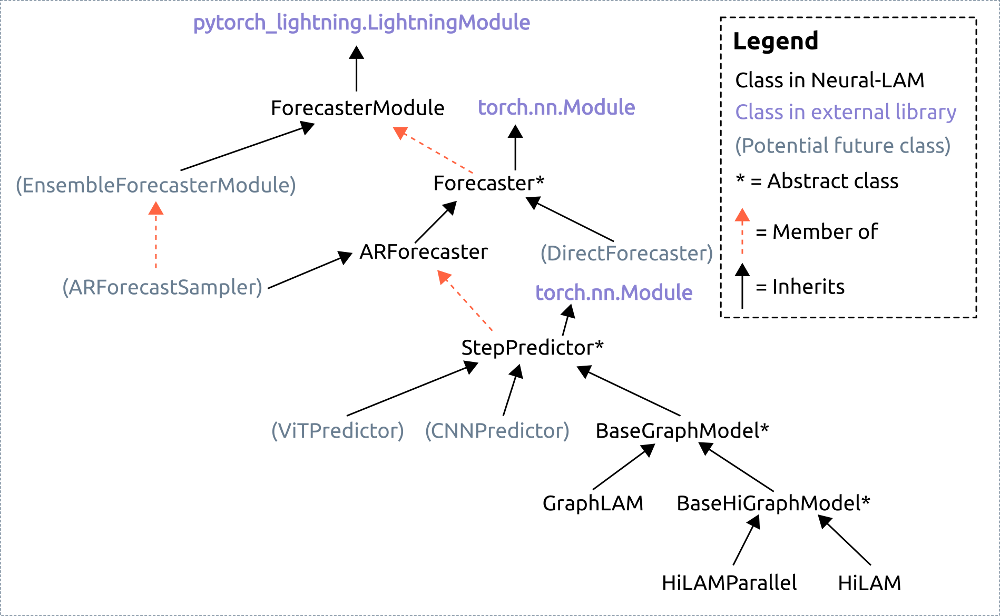

## Background
The different models that can be trained in Neural-LAM are currently all sub-classes of `pytorch_lightning.LightningModule`. In particular, much of the functionality  sits in the first subclass, `ARModel`. The current hierarchy looks like this:

(I am making these rather than some more fancy UML-diagrams since I think this should be enough for the level of detail we need to discuss here).

## The problem
In the current hierarchy everything is a subclass of `ARModel`. This has a number of drawbacks:

* All functionality ends up in one class. There is no clear division of responsibility, but rather we end up with one class that does everything from logging, device-handling, unrolling forecasts and the actual forward and backward pass through GNNs.
* The subclasses do not utilize the standard torch `forward` calls, but rather must resorts to our own similar construction (e.g. `predict_step`)
* This limits us to deterministic, auto-regressive models.
* This is hard to extend upon for ensemble-models.

## Proposed new hierarchy
I propose to split up the current class hierarchy into subclasses that have clear responsibilities. These should not just all inherit `ARModel`, but rather be members of each other as suitable. A first idea for this is shown below, including also potential future classes for new models (to show how this is more extendible):

The core components are (I here count static features as part of forcing):

* `ForecasterModule`: Takes over much of the responsibility of the old `ARModel`. Handles things not directly related to the nerual network components such as plotting, logging, moving batches to the right device. This inherits `pytorch_lightning.LightningModule` and have the different train/val/test steps. In each step (train/val/test), unpacks the batch of tensors and uses a `Forecaster` to produce a full forecast. Also responsible for computing the loss based in a produced forecast (could also be in `Forecaster`, not entirely sure about this).
* `Forecaster`: A generic forecaster capable of mapping from a set of initial states, forcing and boundary forcing into a full forecast of the requested length.
  * `ARForecaster`: Subclass of `Forecaster` that uses an auto-regressive strategy to unroll a forecast. Makes use of a `StepPredictor` at each AR step.
* `StepPredictor`: A model mapping from the two previous time steps + forcing + boundary forcing to a prediction of the next state. Corresponds to the $\hat{f}$ function in [Oskarsson et al.](https://arxiv.org/abs/2309.17370).
  * We find the existing graph models now as subclasses to `StepPredictor`.

In the figure above we can also see how new kinds of models could fit into this hierarchy:

* Ensemble models using an auto-regressive strategy to sample the state at each time step.
* Other types of single-step-predictors, e.g. using CNNs or Vision-Transformers.
* Non-autoregressive strategys for creating a full forecast, in particular direct forecasting.

This is supposed to be a starting point for discussion and there will likely be things I have not thought about. Some parts of this will have to be hammered out when actually writing these classes, but I'd rather have the discussion whether this is a good direction to take things before starting to do too much work. Tagging @leifdenby and @sadamov for visibility.
